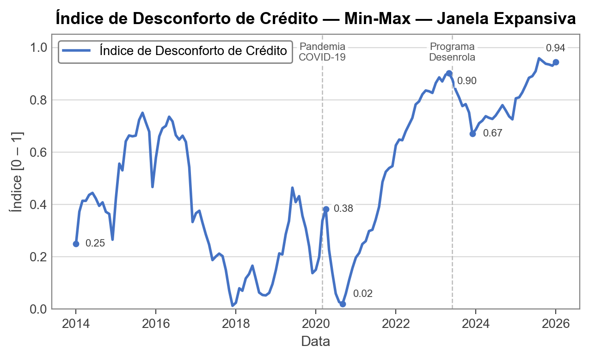
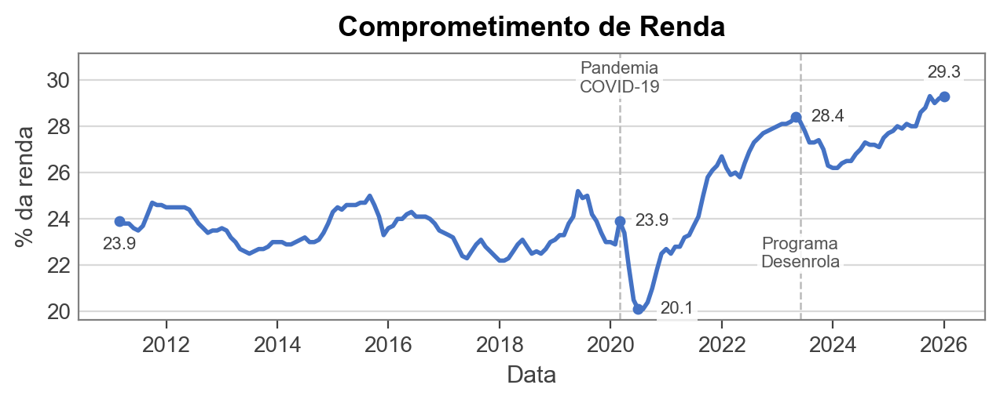
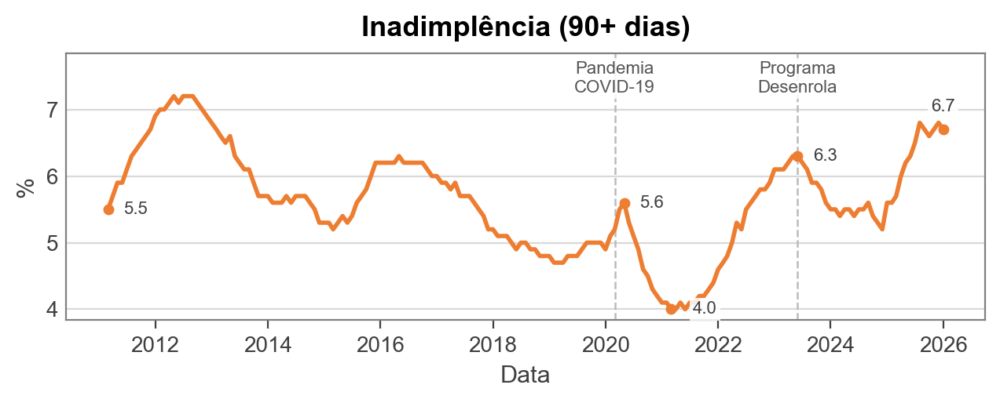
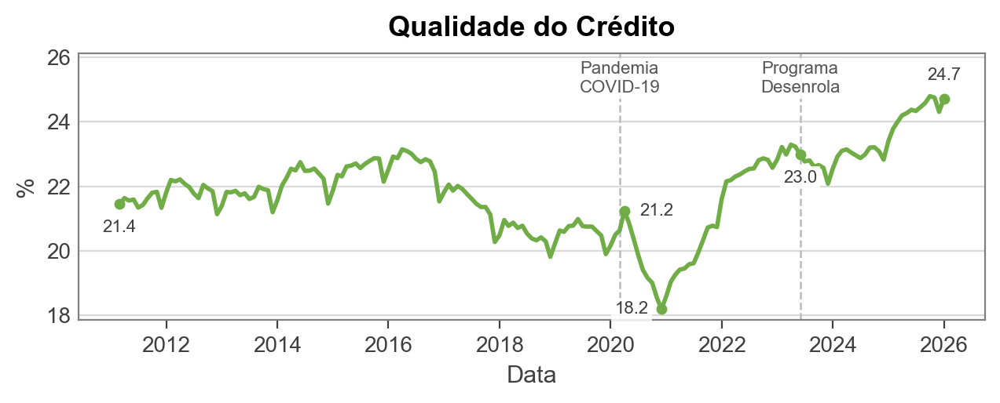

# Índice de Desconforto de Crédito

Autores: Lauro Gonzalez, Rafael Schiozer, Matheus L. Carrijo

Este repositório contém o código e a documentação para a construção de um **índice** que captura o nível de desconforto de crédito das famílias brasileiras.

## Última Divulgação: fevereiro de 2026

**O IDC mostra quão perto o desconforto de crédito das famílias está do pior nível já observado no histórico disponível.**


Com a divulgação em **abr-2026** das estatísticas monetárias e de crédito do Banco Central, o último mês calculável do IDC é **fev-2026**, pois a série de comprometimento de renda está disponível somente até esse mês

| Indicador | Valor bruto | Valor normalizado |
|---|---:|---:|
| IDC | — | **1,000** |
| C — comprometimento de renda | 29,7% | 1,000 |
| I — inadimplência 90+ dias | 7,2% | 1,000 |
| Q — crédito oneroso no crédito livre PF | 25,1% | 1,000 |


O valor **1,000** indica que, em fev-2026, o desconforto de crédito atingiu o ponto máximo da janela histórica observada pelo índice. Como os três componentes também estão em `1,000` após normalização, o resultado reflete uma combinação simultânea de comprometimento de renda, inadimplência e composição do crédito em seus maiores níveis relativos na amostra.

É importante destacar que o IDC não é uma medida absoluta de endividamento; ele indica a posição do mês corrente em relação ao histórico disponível.


## Séries Completas

### IDC



### Componentes Brutos







## Divulgação e Repercussão

O relatório original de divulgação da criação do índice foi publicado em [Índice de Desconforto de Crédito (IDC)](https://eaesp.fgv.br/producao-intelectual/indice-desconforto-credito-idc). A partir da divulgação inicial, o IDC é atualizado e divulgado sempre que o Banco Central atualiza os dados usados no índice, possivelmente em frequência mensal.

A criação do IDC e seus resultados iniciais foram repercutidos em reportagens e artigo de opinião:

- [R7 — Desconforto do brasileiro com o crédito atinge maior nível em 12 anos; entenda](https://noticias.r7.com/economia/desconforto-do-brasileiro-com-o-credito-atinge-maior-nivel-em-12-anos-entenda-27042026/) (27/04/2026)
- [UOL — Novo indicador da FGV mede mal-estar da população com o endividamento](https://economia.uol.com.br/colunas/mariana-barbosa/2026/04/24/novo-indicador-da-fgv-mede-mal-estar-da-populacao-com-o-endividamento.htm) (24/04/2026)
- [Valor Econômico — Desconforto das famílias com crédito atinge o maior nível em 12 anos, diz FGV EAESP](https://valor.globo.com/brasil/noticia/2026/04/24/desconforto-das-famlias-com-crdito-atinge-o-maior-nvel-em-12-anos-diz-fgv-eaesp.ghtml) (24/04/2026)
- [Valor Econômico — Medindo o desconforto do crédito no Brasil](https://valor.globo.com/opiniao/coluna/medindo-o-desconforto-do-credito-no-brasil.ghtml), artigo de opinião sobre o IDC.
- [SBT News — Famílias comprometem 29% da renda com dívidas e pressão do crédito cresce](https://sbtnews.sbt.com.br/noticia/economia/familias-comprometem-29-da-renda-com-dividas-e-pressao-do-credito-cresce) (24/04/2026)

## 1. Motivação

O projeto surge no contexto de:

- Crescente debate público sobre **endividamento das famílias**
- Políticas recentes como o **Programa Desenrola**
- Interesse em criar uma métrica análoga ao "índice de desconforto econômico" tradicional (inflação + desemprego), mas focada em **crédito**

## 2. Estrutura do Índice

O índice é composto por **três dimensões**, cada uma com dados disponíveis na planilha mensal de Estatísticas Monetárias e de Crédito do Banco Central, armazenada em `data/raw/YYYYMM/` com o prefixo de competência usado pelo próprio BC. Para mais informações sobre os dados, ver a seção 8 abaixo.

### 2.1. Comprometimento de renda com dívida

- Código SGS: `29034`
- Conceito: Comprometimento de renda - Relação entre o valor correspondente aos pagamentos esperados para o serviço da dívida com o Sistema Financeiro Nacional e a renda mensal das famílias, em média móvel trimestral, ajustado sazonalmente.
- Para mais informações sobre a série: [https://dadosabertos.bcb.gov.br/dataset/29034-comprometimento-de-renda-das-familias-com-o-servico-da-divida-com-o-sistema-financeiro-nacion](https://dadosabertos.bcb.gov.br/dataset/29034-comprometimento-de-renda-das-familias-com-o-servico-da-divida-com-o-sistema-financeiro-nacion)

### 2.2. Inadimplência da carteira de crédito (90+ dias)

- Código SGS: `21112`
- Conceito: Percentual da carteira de crédito livre do Sistema Financeiro Nacional com pelo menos uma parcela com atraso superior a 90 dias. Não inclui operações referenciadas em taxas regulamentadas, operações vinculadas a recursos do BNDES ou quaisquer outras lastreadas em recursos compulsórios ou governamentais.
- Para mais informações sobre a série: [https://dadosabertos.bcb.gov.br/dataset/21112-inadimplencia-da-carteira-de-credito-com-recursos-livres---pessoas-fisicas---total](https://dadosabertos.bcb.gov.br/dataset/21112-inadimplencia-da-carteira-de-credito-com-recursos-livres---pessoas-fisicas---total)

### 2.3. Qualidade do crédito (composição do crédito "caro")

Mede a fração do crédito livre de pessoa física alocada em modalidades consideradas mais onerosas.

Componentes:

- Cheque especial (código SGS: `20573`)
- Crédito pessoal não consignado (código SGS: `20574`)
- Cartão de crédito rotativo (código SGS: `20587`)
- Cartão de crédito parcelado (código SGS: `20588`)

Métrica:

- Participação dessas modalidades no total de crédito livre para pessoa física (código SGS: `20570`), expressa como **fração [0, 1]** (e.g., 0,21 = 21% do crédito livre PF alocado em modalidades onerosas)

## 3. Construção do Índice

### 3.1. Normalização Min-Max

Como as três séries têm escalas distintas, cada componente é normalizado antes da agregação utilizando o método **Min-Max** com **janela expansiva**:

$$
x^{norm}_t = \frac{x_t - \min_\tau(x)}{\max_\tau(x) - \min_\tau(x)}
$$

onde $\min_\tau$ e $\max_\tau$ denotam o mínimo e o máximo calculados sobre a janela de referência $\tau = \{1, \ldots, t\}$. O resultado indica **qual fração do range histórico o valor atual representa**: 0 corresponde ao mínimo histórico e 1 ao máximo.

A janela é **expansiva** — cresce a partir do início da amostra (mar-2011), sem viés de lookahead: em cada período $t$, utilizam-se apenas observações disponíveis até $t$. Os primeiros anos do histórico servem como período de aquecimento; o índice é exibido a partir de **jan-2014** (~34 meses de aquecimento).

### 3.2. Agregação

Após normalização, o índice é calculado como média simples dos três componentes:

$$
\text{Índice}_t = \frac{1}{3} (C_t + I_t + Q_t)
$$

onde:

- $C_t$: comprometimento de renda (normalizado)
- $I_t$: inadimplência (normalizada)
- $Q_t$: qualidade do crédito (normalizada)

## 4. Horizonte Temporal

O horizonte efetivo do índice é determinado pela série mais curta disponível na planilha mensal do Banco Central — em geral, a SGS 29034 (comprometimento de renda), que é publicada com maior defasagem que as demais. A planilha pode conter observações mais recentes para algumas séries, mas o índice usa apenas os meses em que os três componentes C, I e Q estão disponíveis. O índice é exibido a partir de **jan-2014**, após ~34 meses de aquecimento da janela expansiva.

Assim, a competência da divulgação do Banco Central não necessariamente coincide com o último mês calculável do IDC. Por exemplo, a divulgação **202604** traz a série de comprometimento de renda até **fev-2026** e as demais séries usadas no índice até **mar-2026**; como o IDC exige todos os componentes no mesmo mês, o índice calculado com essa divulgação termina em **fev-2026**.

## 5. Como Reproduzir

**Pré-requisitos:** Python 3.9+ com as dependências listadas em `requirements.txt`:

```bash
pip install -r requirements.txt
```

**Atualização mensal dos dados do Banco Central** a partir do diretório raiz do projeto:

```bash
python -m src.download_bcb_release 202604
```

O comando acima baixa a tabela XLSX e o PDF do relatório mensal do Banco Central para `data/raw/202604/`. Por padrão, arquivos existentes não são sobrescritos; use `--overwrite` para forçar novo download.

**Execução do índice** a partir do diretório raiz do projeto:

```bash
python main.py
```

O script carrega automaticamente a planilha mais recente em `data/raw/YYYYMM/`, constrói os três componentes e o índice (normalização min-max com janela expansiva), salva os CSVs em `data/processed/` e as figuras em `outputs/figures/`. O relatório final do projeto fica em `outputs/report/`.

## 6. Estrutura do Repositório

```
├── data/
│   ├── raw/
│   │   ├── 202603/
│   │   │   ├── 202603_Tabelas_de_estatisticas_monetarias_e_de_credito.xlsx
│   │   │   └── 202603_Texto_de_estatisticas_monetarias_e_de_credito.pdf
│   │   └── 202604/
│   │       ├── 202604_Tabelas_de_estatisticas_monetarias_e_de_credito.xlsx
│   │       └── 202604_Texto_de_estatisticas_monetarias_e_de_credito.pdf
│   └── processed/
│       ├── series_raw.csv
│       ├── components_raw.csv
│       └── index.csv
├── src/
│   ├── download_bcb_release.py   # baixa a divulgação mensal do BCB (XLSX + PDF)
│   ├── load_data.py     # carrega as séries do Excel
│   ├── normalize.py     # normalização min-max com janela expansiva
│   ├── build_index.py   # constrói componentes C, I, Q e agrega o índice
│   └── plot.py          # gera as figuras
├── outputs/
│   ├── figures/         # 6 figuras (PNG)
│   └── report/          # relatório final (não versionado)
├── main.py              # ponto de entrada
├── CITATION.cff         # autoria e citação recomendada
├── LICENSE              # licença MIT para o código-fonte
├── LICENSE-DATA.md      # licença CC BY 4.0 para documentação e outputs autorais
├── requirements.txt
└── README.md
```

## 7. Outputs Gerados

**Dados (`data/processed/`):**

- **`series_raw.csv`** — séries brutas carregadas do Excel
- **`components_raw.csv`** — componentes C, I, Q antes da normalização
- **`index.csv`** — componentes normalizados (C_norm, I_norm, Q_norm) e índice agregado (a partir de jan-2014)

**Figuras (`outputs/figures/`):**

| Arquivo | Conteúdo |
|---|---|
| `components_raw.png` | Componentes C, I, Q em valores brutos (não normalizados) |
| `components_raw_c.png` | Componente C em valores brutos |
| `components_raw_i.png` | Componente I em valores brutos |
| `components_raw_q.png` | Componente Q em valores brutos |
| `components_normalized.png` | Componentes normalizados por Min-Max sobrepostos |
| `index.png` | Índice de Desconforto de Crédito |

**Relatório (`outputs/report/`):**

- **`IDC-report.docx`** — relatório final do projeto. A pasta é ignorada pelo Git para evitar versionamento de versões locais do documento.

## 8. Estrutura e Fontes de Dados

Os arquivos mensais em **`data/raw/YYYYMM/`** são a **fonte primária** para a construção do índice. Cada pasta mensal preserva o prefixo de competência `YYYYMM` usado pelo Banco Central no arquivo disponibilizado para download.

Para cada competência, são armazenados dois arquivos:

- **`YYYYMM_Tabelas_de_estatisticas_monetarias_e_de_credito.xlsx`** — planilha usada no cálculo do índice.
- **`YYYYMM_Texto_de_estatisticas_monetarias_e_de_credito.pdf`** — relatório do Banco Central que acompanha a divulgação mensal dos dados.

O módulo `src.load_data` localiza automaticamente a planilha mais recente disponível em `data/raw/YYYYMM/`. O script `src.download_bcb_release` automatiza o download mensal desses dois arquivos:

```bash
python -m src.download_bcb_release YYYYMM
```

- Obtido em: [https://www.bcb.gov.br/estatisticas/estatisticasmonetariascredito](https://www.bcb.gov.br/estatisticas/estatisticasmonetariascredito)
- Trata-se de uma **compilação oficial do Banco Central do Brasil** de um subconjunto selecionado de séries temporais do Sistema Gerenciador de Séries Temporais (SGS).
- Reúne, em uma única planilha, as principais séries necessárias para o índice.
- As observações mais recentes são marcadas com `*` na planilha, indicando **dados preliminares** sujeitos a revisão. Essas observações são incluídas no índice sem tratamento especial.

**Identificação das séries dentro da planilha:** em cada aba, a **linha 7** contém o cabeçalho `SGS` com o número identificador de cada série no sistema SGS/BCB. Exemplo: a série **29034** está na célula **D7** da aba **`Tab 27`**.

---

## 9. Autoria e Citação

O Índice de Desconforto de Crédito (IDC) foi idealizado e implementado por **Lauro Gonzalez**, **Rafael Schiozer** e **Matheus L. Carrijo**, pesquisadores integrantes do **FGVcemif** e da **FGV-EAESP**.

Ao citar ou reutilizar o IDC, recomenda-se a seguinte referência:

> Gonzalez, Lauro; Schiozer, Rafael; Carrijo, Matheus L. Índice de Desconforto de Crédito (IDC). FGVcemif/FGV-EAESP. Licenciado sob CC BY 4.0.

Veja também o arquivo [CITATION.cff](CITATION.cff).

## 10. Licença

Este repositório usa licenciamento em camadas:

- O **código-fonte** é disponibilizado sob a [MIT License](LICENSE).
- A **documentação autoral, metodologia autoral, figuras, componentes calculados e índice agregado produzidos pelo IDC** são disponibilizados sob a [Creative Commons Attribution 4.0 International (CC BY 4.0)](LICENSE-DATA.md), salvo indicação em contrário.
- **Dados brutos, planilhas, relatórios, PDFs, documentação metodológica e demais materiais obtidos do Banco Central do Brasil ou de terceiros não são relicenciados por este repositório**. Esses materiais permanecem sujeitos aos termos, licenças e condições das respectivas fontes originais.
